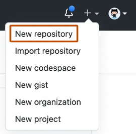
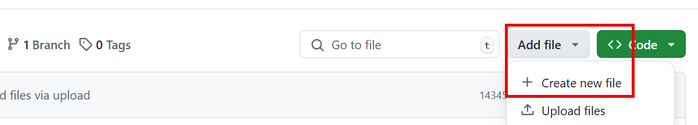
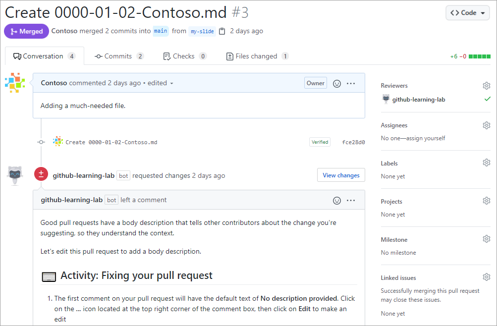
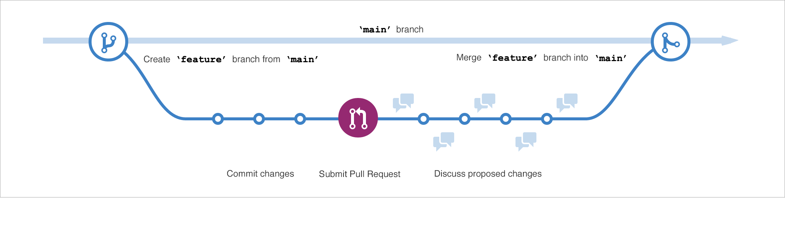
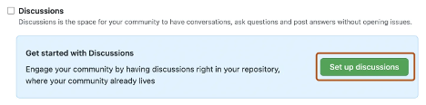
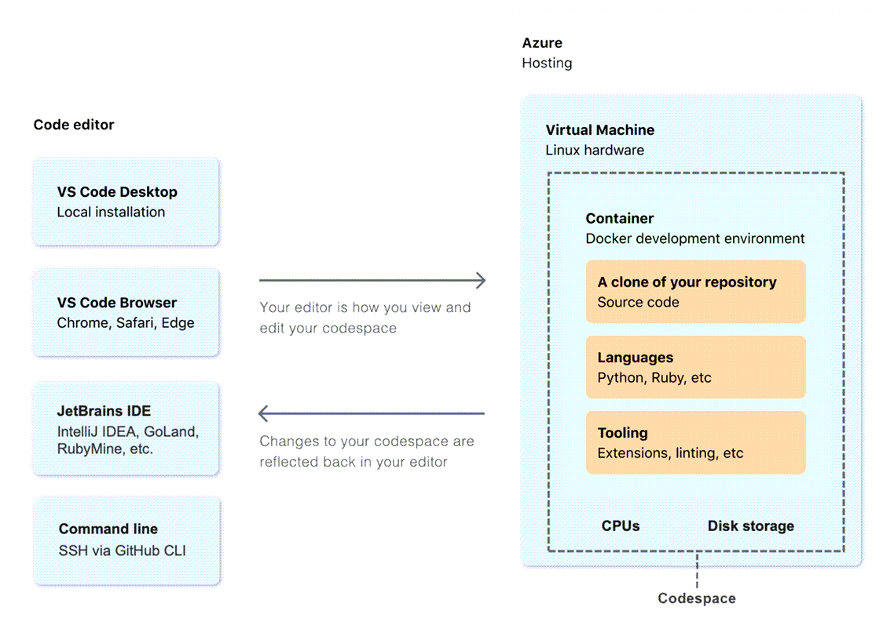
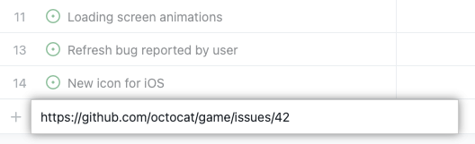
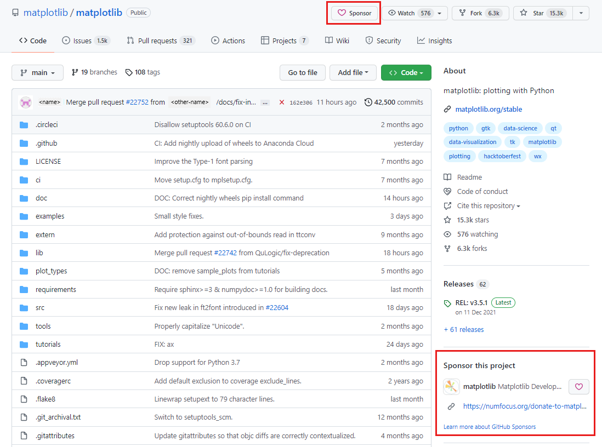

# GitHub Foundations

## Introduction to Git

### What is version control?

A version control system (VCS) is a program or set of programs that tracks changes to a collection of files. With the goal to easily recall earlier versions of individual files or of the entire project.

Another name for a VCS is software configuration management (SCM). VCS is one of the practices involved in SCM.

Instances of VCS used a centralized server to store a project history. This centralization meant that the one server was also potentially a single point of failure.

**Git is distributed**, which means that a project's complete history is stored both on the client and on the server.

### Git terminology

- **Working tree**: The set of nested directories and files that contain the project that's being worked on.
- **Hash**: Git uses hashes that are 160 bits long, to identify if a file has changed or not. If the file timestamp is changed, but the file hash isn't changed, Git knowns the file contents aren't changed.
- **Object**: A Git repo contains four types of objects:
  - A blob object that contains an ordinary file.
  - A tree object represents a directory.
  - A commit object represents a specific version of the working tree.
  - A tag is a name attached to a commit.
- **Branch**: Is a named series of linked commits. The most recent commit of a branch is called the _head_.

### Git and GitHub

As mentioned previously, Git is a distributed version control system (DVCS). GitHub is a cloud platform that uses Git as its core technology, that acts as the remote repository.

### Basic Git commands

- `git status`
- `git add`
- `git commit`
- `git log`
- `git help`

## Introduction to GitHub

### What is GitHub?

GitHub is a cloud-based platform that uses Git, a distributed version control (DVCS) system, as its core.

#### Four pillars of GitHub

- **AI**: The GitHub Enterprise platform is enhancing collaboration through AI-powered pull requests and issues through Copilot, and security by automating security checks faster.
- **Collaboration**: Repos, Issues, Pull Requests, and other tools to help the whole company to work faster, cut down approval times, and ship more quickly.
- **Productivity**: CI/CD tools directly integrated into the workflow, the platform gives users the ability to set tasks and forget them. Giving time to developers to focus on what matters most.
- **Security**: GitHub Enterprise platform includes native, first-party security features that minimize security risk with a built-in security solutions. Security Overview and Dependabot are those features.

#### What is a repository?

A repository contains all of your project's files and each file's revision history.

- To create a repository, click on the plus button at the top right:



- To add a file to your repo, click on the **Add file** button



#### What are gists?

Similarly to repositories, gists are a simplified way to share code snippets with others.
Basically, gist is a Git repository, which you can fork and clone to be made either public or secret.

#### What are wikis?

Every repository on GitHub comes equipped with a section for hosting documentation, called a wiki. While a README file quickly tells what your project can do, you can use a wiki to provide additional documentation.

### Components of the GitHub flow

#### What are branches?

Branches are an essential part to the GitHub experience because they're where we can make changes without affecting the entire project we're working on. Your branch is a safe place to experiment with new features or fixes.

#### What are commits?

A commit is a change to one or more files on a branch. Every time a commit is created, it's assigned a unique ID and tracked along with the time and contributor.

Within a git repository, a file can exist in several valid states as it goes through the version control process. The primary states for a file in a Git repository are **Untracked** and **Tracked**. These two states consist if Git is aware or not of the file existence.

Tracked files are actively monitored by Git. And have the following substates:

- Unmodified: The file is tracked, but it hasn't been modified since the last commit.
- Modified: The file(s) has been changed since the last commit, is not staged yet.
- Staged: The modified file(s) are ready to be committed into the staged area (aka. index)
- Committed: The file is in the repository's database. It represents the last committed version of the file.

#### What are pull requests?

A pull request is the mechanism used to signed that **the commits from one branch are ready to be merged into another branch**.

A team member who submits a pull request can request the review of other team members before the merge.

Once the changes have been approved (if required), the pull request's source branch is merged into the base branch.



#### The GitHub flow



The GitHub flow can be defined as a lightweight workflow that allows for safe experimentation. You can test new ideas and collaborate with your team by using branching, pull requests, and merging.

1. Start by creating a branch so that the changes, features and fixes you create don't affect the main branch.
2. Next, make your changes on the branch you have created for experimentation.
3. Now, create a pull request to ask collaborators for feedback. On this step, reviews are important prior to the merge with the main branch.
4. If the code is reviewed and approved, the merge can occur to sync the code changes on the main branch.
5. Finally, you can delete your branch. To prevent that others use accidentally old branches.

### GitHub is a collaborative platform

Along of the features that allow to keep the project up-to-date as branches, and pull requests. GitHub has more features to improve collaboration within repositories.

#### Issues

GitHub Issues were created to track ideas, feedbacks, tasks, or bugs for work on GitHub. An issue can be created from a repository:


Issues can be attached to a project, a pull request, and to a label as well.

#### Discussions

Discussions are for conversations accessible to everyone and aren't related to code.

> [!NOTE]
> Discussion is enabled on repository settings



### GitHub platform management

#### Managing notifications and subscriptions

You can choose to receive ongoing updates about specific activity on GitHub through a subscription. Notifications are the updates that you receive for specific activity to which you're subscribed.

##### Subscription options

You can choose to subscribe to notifications for:

- A conversation in a specific issue, pull request, or gist.
- CI activity, such as the status of workflows in repositories set up with GitHub Actions.
- Repository issues, pull requests, releases, security alerts, or discussions (if enabled).
- All activities in repository.

##### What are GitHub Pages?

GitHub Pages is a static site-hosting service that takes HTML, CSS, and Javascript files straight from a repository on GitHub.
Optionally, you can run the files through a build process and publish a website. Edit and push your changes, and your project is live for the public in a visually organized way.

## Introduction to GitHub's products

### GitHub accounts and plans

There are three types of GitHub accounts:

- Personal
- Organization
- Enterprise

#### Personal accounts

Every person who uses GitHub.com signs into a personal account. Your personal/user account can own resources such as repositories, packages, and projects and has a straightforward way to manage your permission. Actions that you take, are attributed to your personal account.

Each personal account uses either GitHub Free or Pro. All personal accounts own an unlimited number of public and private repositories. **If you use GitHub Free, private repositories owned by your personal account have a limited feature set.**

#### Organization accounts

Organization accounts are shared accounts where an unlimited number of people can collaborate across many projects at once. Unlike personal accounts, permissions with organization accounts are done with a tiered approach.

Orgs can also own resources such as repositories, packages, and projects. However, you can't sign into an organization. Instead, each person signs into their own personal account, and any actions on the organization resources are attributed to their personal accounts. **Each personal account can be a member of multiple organizations**.

#### Enterprise accounts

Enterprise accounts on GitHub.com allow admins to centrally manage policies and billing for multiple organizations and enable inner sourcing between their organizations.

Organizations are shared accounts for enterprise members to collaborate across many projects at once. Owners can invite existing organizations to join your enterprise account.

### GitHub plans

There are several free GitHub products, in addition to the paid ones:

- GitHub Free for personal accounts and organizations
- GitHub Pro for personal accounts
- GitHub Team
- GitHub Enterprise

#### GitHub Free for personal accounts

Signing up for GitHub Free gives a new user a personal user account. A personal user account includes unlimited public and private repositories and unlimited collaborators.

With GitHub Free, a personal account includes:

- GitHub Community Support
- Dependabot alerts
- Two-factor authentication enforcement
- 500-MB GitHub Packages storage
- 120 GitHub Codespaces core hours per month
- 15-GB GitHub Codespaces storage per month
- GitHub Actions:
  - 2,000 minutes per month
  - Deployment protection rules for public repositories

#### GitHub Free for organizations

With GitHub Free for organizations, you can work with unlimited collaborators on unlimited public repositories, with a full feature set. Or, unlimited private repository with a limited feature set.

In addition, teams can work and manage groups.

#### GitHub Pro

GitHub Pro is similar to GitHub Free with upgraded features:

- GitHub Support via email
- 3,000 GitHub Actions minutes per month
- 2-GB GitHub Packages storage
- 180 GitHub Codespaces core hours per month
- 20-GB GitHub Codespaces storage per month
- Advanced tools and insights in private repositories:
  - Required pull request reviewers
  - Multiple pull request reviewers
  - Protected branches
  - Code owners
  - Autolinked references
  - GitHub Pages
  - Wikis
  - Repository insight graphs for pulse, contributors, traffic, commits, code frequency, network, and forks

#### GitHub Team

GitHub Team is the version of **GitHub Pro for organizations**. GitHub Team is better than GitHub Free for organizations because it provides increased GitHub Actions minutes and extra GitHub Packages storage.

- GitHub Support via email
- 3,000 GitHub Actions minutes per month
- 2-GB GitHub Packages storage
- Advanced tools and insights in private repositories:
  - Required pull request reviewers
  - Multiple pull request reviewers
  - Draft pull requests
  - Team pull request reviewers
  - Protected branches
  - Code owners
  - Scheduled reminders
  - GitHub Pages
  - Wikis
- Repository insight graphs for pulse, contributors, traffic, commits, code - frequency, network, and forks
- The option to enable or disable GitHub Codespaces

#### GitHub Enterprise

GitHub Enterprise accounts enjoy a greater level of support and extra security, compliance, and deployment controls.

You can create one or more enterprise accounts. And you are assigned the role of _enterprise owner_. In that role, you can add and remove organizations to and from the enterprise account.

In addition to the features available with GitHub Team, GitHub Enterprise includes:

- GitHub Enterprise Support
- More security, compliance, and deployment controls
- Authentication with security assertion markup language (SAML) single sign-on
- Access provisioning with SAML or System for Cross-domain Identity Management (SCIM)
- Deployment protection rules with GitHub Actions for private or internal - repositories GitHub Connect
- The option to purchase GitHub Advanced Security

There are two different GitHub Enterprise options:

- GitHub Enterprise Server
- GitHub Enterprise Cloud

The significant difference is that GitHub Enterprise Server (GHES) is a self-hosted solution that allows organizations to have a full control over their infrastructure.

GitHub Enterprise Cloud includes a dramatic increase in both GitHub Actions minutes and GitHub Packages storage, including extra features:

- 50,000 GitHub Actions minutes per month
- 50-GB GitHub Packages storage
- A service level agreement for 99.9% monthly uptime
- Option to centrally manage policy and billing for multiple GitHub.com - organizations with an enterprise account
- Option to provision and manage the user accounts for your developers, by using Enterprise Managed Users

### GitHub Mobile and GitHub Desktop

GitHub Mobile and GitHub Desktop are options to access your GitHub account aside from github.com.

#### GitHub Mobile

Allows you to access securely your GitHub account from mobile devide to perform several activities as:

- Read, and review Pull Requests
- Receive notifications based on mentions
- Secure your Github.com account with two-factor authentication

#### GitHub Desktop

GitHub Desktop is an open-source, stand-alone software application that simplify the usage of Git in GitHub through an user interface. Users can:

- Add and clone repositories
- Check out branches with pull requests and view CI statuses
- Compare changed images

### GitHub billing

GitHub bills separately for your personal account, and for each organization or enterprise account you own.
Each bill is a combination of charges for your subscriptions and usage-based billing.

- **Subscriptions** include your account's plan, such as GitHub Pro or GitHub Team, and paid products as GitHub Copilot and apps from GitHub Marketplace.
- **Usage-based billing** applies when the cost of a paid product depends on how much you use the product. For example, the cost of GitHub Actions depends on how many minutes your jobs spend running and how much storage your artifacts use.

## Configure code scanning on GitHub

### What is code scanning?

Code scanning uses CodeQL to analyze the code in a GitHub repository to find security vulnerabilities and coding errors. You can use code scanning to find, triage, and prioritize fixes for existing problems in your code.

### About code scanning with CodeQL

- Use default setup to quickly configure CodeQL analysis for code scanning on your repository. The default setup handles choosing the languages to analyze, query suite to run, and events that trigger scans with the option to manually configure the languages and query suites.
- Use advanced setup to add the CodeQL workflow directly to your repository, using your workflow file with the [github/codeql-action](https://github.com/github/codeql-action/).
- Run the CodeQL CLI directly in an external CI system and upload the results to GitHub.

### Enable code scanning with third party tools

Instead of running code scanning in GitHub, you can perform analysis elsewhere and then upload the results. You can upload Static Analysis Results Interchange Format (SARIF) files generated outside GitHub.

### About SARIF file uploads for code scanning

Github creates code/scanning alerts in a repository using information from SARIF files. You can generate SARIF files using many static analysis-security testing tools, including CodeQL.

## Introduction to GitHub Copilot

### GitHub Copilot, your AI pair programmer

Powered by OpenAI Codex, GitHub Copilot acts as a pair programmer that can help you to create and manipulate code quickly, to focus on topics that really matter.
GitHub Copilot offer three features:

#### Copilot chat

Like ChatGPT, Copilot chat can be used to make questions and queries considering the context that you are working with. Using GitHub Copilot in your favorite IDE, the Copilot chat feature is capable based on the file, and project that you are working, to provide accurate feedbacks and answers.

#### Copilot for pull requests

OpenAI GPT-4 model adds support in GitHub Copilot for AI-powered tags in pull-request description through a GitHub app installed by admins or repository owners. GitHub Copilot can automatically fills out pull request description based on the changed code, send on the pull request.

#### Copilot for the CLI

Developers spend most of their time on the terminal using several CLI's, GitHub Copilot also support queries directly on the terminal to reduce the amount of times developers switch to another programs and sites.

### Subscription plans

#### GitHub Copilot Business

GitHub Copilot Business allows you to control who can use GitHub Copilot in your business. The access can be granted for individuals and teams.

#### GitHub Copilot Enterprise

GitHub Copilot Enterprise is available for organizations through GitHub Enterprise Cloud. And the main different between GitHub Copilot Business is the plus layer of personalization for organizations.
GitHub Copilot Enterprise can index an organization's codebase for a deeper understanding and for suggestions that are more tailored. If offers access to GitHub Copilot customization to fine-tune private models for code completion.

### Interact with Copilot

#### Inline suggestions

Inline suggestions are the most immediate form of assistance in Copilot. As you type, Copilot analyzes your code and context to offer real-time code completions. This feature predicts what you might want to write next and displays suggestions.

- To accept suggestions please `TAB` and to reject press `ESC`

#### Command palette

The command palette provides quick access to various functions in Copilot, so you can perform complex tasks with only a few keystrokes.

1. Open the command palette in Visual Studio Code by selecting `Ctrl+Shift+P` or `Cmd+Shift+P` on Mac.
2. Enter Copilot to see available commands
3. Select actions like Explain This or Generate Unit Tests to get assistance

#### Copilot chat again

Copilot chat is an interactive feature that enables you to communicate with Copilot by using natural language. You can ask questions or request code snippets, and Copilot provides responses based on your input.

For example: "How do I implement a binary search in Python?"

Copilot is ideal for exploring new coding concepts or getting help with unfamiliar syntax.

#### Inline chat

Inline chat enables context-specific conversations with Copilot directly within your code editor.

1. Place the cursor where you want assistance
2. Use the keyboard shortcut `Ctrl+I` or `Cmd+I` to open inline chat.\
3. Ask questions or request changes specific to that code location

#### Comments to code

Copilot uses natural language processing to convert comments into code.

Here is an example:

```text
# Generate a hello world with Typescript
    // Code written by GitHub Copilot based on the comments
```

#### Multiple suggestions

For complex code snippets, Copilot can offer multiple alternatives.

1. When Copilot offers a suggestion, look for the light bulb icon.
2. Select the icon or use `Alt+]` or `Option+]` to cycle through alternatives

#### Explanations

Understanding existing code is crucial, especially in large projects. You can use the **Explain This** feature to get explanations for code snippets.

1. Select a block of code
2. Right-click the code block, and then select Copilot: **Explain This** on the shortcut  menu
3. Read the explanation that Copilot provides for the selected code

## Code with GitHub Codespaces

GitHub Codespaces is configurable, allowing you to create a customized development environment for your project.

### Create a Codespace

Codespaces can be created on GitHub.com, in Visual Studio Code, or by GitHub CLI. And there are four ways to create a Codespace:

- From a GitHub template or any template repository on GitHub.com to start a new project
- From a branch in your repository, for new feature work
- From an open pull request, to explore work-in-progress
- From a commit in a repository's history to investigate a bug at a specific point in time

#### Codespace creation process



When you create a GitHub Codespace, four processes occur:

1. A virtual machine and storage are assigned to your Codespace
2. A container is created
3. A connection to the Codespace is mage
4. A post-creation setup is made

### Personalize your Codespace

Codespaces support several personalizations in line with your environment requirements. Follow some of the customizations:

- **Settings sync**: You can synchronize your VS Code settings between your desktop application with VS Code web client
- **Dotfiles**: You can a dotfiles repository to specify scripts, shell preferences, and other configurations
- **Change your shell**: You can define your preferred shell
- **Set a region**: A region can be defined to host your code space
- **Timeout configuration**: Configure a timeout to stop your Codespace - Default 30 minutes
- Configure automatic deletion: Inactive Codespaces are automatically deleted. You can configure how long your Codespace is retained, up to a maximum of 30 days

### Codespaces versus GitHub.dev editor

You can use GitHub.dev to navigate files and source code repositories from GitHub, and commit code changes. If you want to do more heavy lifting like testing your code, use GitHub Codespaces. It has compute associate with it so you can build and run your code, and have terminal access.

You can start your workflow in GitHub.dev editor and continue working on Codespaces to build your code or debug it.

## Manage your work with GitHub Projects

GitHub Projects is a space inside GitHub, where the work can be organized, planned, and executed.

There are several enhancements on the new Project experience. Which enables more customization.

### Creating an organization-level project

It is possible to create a project for your organization, following this steps:

1. In the top right corner of GitHub.com, select your profile photo, then select Your organizations.
2. Scroll down to select the organization for your new Project.
3. Navigate from the Overview tab to the Projects tab.
4. Select the green button labeled New Project.
5. A pop-up prompts you to select either a template or start from scratch. Let's choose the Start from scratch option and select Table.
6. Select the green Create project button.

### Add an existing issue and pull request to your project

Simply copy the issue/pull request URL on the text input field to create new issue.



## Contribute to an open-source project on GitHub

You can find a topic of interest using [GitHub search](https://github.com/search) and filtering by Topics on the right side.

### Familiarize yourself with an open-source project

Open-source projects usually have these documents at the top level of the repository:

- LICENSE - The project must contain an open-source license
- README - Serves as a welcome page for the project
- CONTRIBUTING - Guidance on how to contribute to the project
- CODE_OF_CONDUCT - Rules for community members

### Sponsor a project

You can financially support the folks who build and maintain the open-source ecosystem through code.



### Communicate your intent to maintainers

You should always start by communicating your intent to contribute before you do any actual work.

- If you want to work on an existing issue, check that nobody is assigned to it by looking at the **Assignees** section, also check the **Linked pull requests**

- [First contributor repository](https://github.com/firstcontributions/first-contributions)

## Knowledge checks

- Which of the following scenarios is a common use case for a version control system?
  - Making experimental changes to your project in an isolated branch.
- What is another name for a version control system?
  - Software configuration management (SCM) system
- What’s the difference between Git and GitHub?
  - Git lets you work with one or more local branches and push changes to a remote repository. GitHub acts as the remote repository, which is accessed through a website or command-line tools.
- What Git command gives information about how to use Git?
  - `git help`
- What is the best way to report a bug to a GitHub project?
  - Search for the bug in the project's existing issues, and create a new one if it hasn't been reported yet.
- Suppose you created a bug fix on a new branch and want it to become part of the next production build generated from the `main` branch. What should you do next?
  - Create a pull request to merge your new branch into the `main` branch.
- Suppose you'd like to work with a project on GitHub, but you don't have write access to the project. What can you do to contribute?
  - Fork the project's repository to your GitHub account, clone the forked repository to your local machine, push changes to your repository, and submit a pull request to the target (upstream) repository.
- What's the difference between GitHub organization accounts and GitHub personal/user accounts?
  - Organizational accounts are shared accounts, while personal/user accounts are for individuals.
- What's the best reason to decide to upgrade to the GitHub Enterprise product?
  - Because you want to centrally manage users and repositories across multiple organizations.
- What's the purpose of a team?
  - A team is intended to reflect a company or group's structure. It's used to provide cascading access permissions and make it easy to notify all team members via mentions.
- What's a function you can execute on GitHub Mobile?
  - Manage, triage, and clear notifications from github.com
- When code scanning is enabled, what is one default event that triggers a scan?
  - Pushing a change
- Which of the following are the tools used to upload a SARIF file?
  - The tools used are GitHub Actions, the code scanning API, and the CodeQL CLI
- What is the difference between scheduled versus triggered events in code scanning?
  - Scheduled events run based on a specified schedule and triggered events run on code events such a push
- What is GitHub Copilot?
  - GitHub Copilot is an AI pair programmer that you can use to get code suggestions
- What are the supported IDE extensions for GitHub Copilot?
  - VS Code, Visual Studio, Neovim, and JetBrains
- What is the difference between GitHub Copilot Business and GitHub Copilot Enterprise?
  - GitHub Copilot Enterprise has an extra layer of personalization. Organizations use their own codebase to train GitHub Copilot.
- Which directory is the clone placed in after creating a Codespace?
  - ´/workspaces´
- What's the maximum number of Codespaces that you can create per repository or branch?
  - You can create an unlimited number of Codespaces per repository or branch, depending upon available space. When you reach an upper amount of resources, a message displays that an existing Codespace needs to removed/deleted before a new Codespace can be created.
- What happens when Codespace loses internet connectivity?
  - If the connection to the internet is lost while working in a Codespace, you aren't able to access your Codespace.
- What defines the beginning of a Codespace's lifecycle?
  - A Codespace's lifecycle begins when you create a Codespace and ends when you delete it.
- What Project descriptor automatically saves when you change it?
  - Project name
- What does an iteration field help you do in Projects?
  - Allows you to create sequential phases of your project and group issues and pull requests based on the phase.
- What field can you use in order to make a Priority grouping like High, Medium, and Low in your Project?
  - Single select
- What is the easiest way to add automation to your Project?
  - Built-in Automation
- What is the name of the section where you can change the visibility of your Project, close your Project, or delete your Project?
  - Danger zone
- Which of the following Markdown snippets produces the text Hello, world! in bold italics?
  - ***Hello, world!***
- How do you print certain characters, like asterisks (*) and underscores (_), literally on your output?
  - Escape them with a backslash, like \* or \_
- Suppose there's an HTML snippet that you want to include on your GitHub Pages web site, but Markdown doesn't offer a way to render it. What should you do?
  - Just add the HTML inline
- What is the best place on a GitHub repository to find where you can help a project?
  - The README file
- What is the preferred way to ask for help or reviews on a pull request?
  - Add comment in the pull request
- What is needed before you can create a pull request on GitHub?
  - Fork a repo, clone it, commit changes, and push to your fork

## Commands tested on the sandbox

- Initiate a git configuration setting the branch as main

```bash
git init -b main
```

- Create a new branch and check it out

```bash
git checkout -b newBranchName
```

- Creating a CodeQL database for the first scan

```bash
codeql database create .codeql --language=javascript-typescript
```

- Running analyze

```bash
codeql database analyze .codeql --format=sarif-latest --output=./codeql-analyze.sarif
```

- Upload SARIF results

```bash
codeql github upload-results --repository=yuribreion1/second-brain --ref=refs/heads/main --sarif=codeql-analyze.sarif
```

## References

- [GitHub Foundations Practice Test](https://ghcertified.com/practice_tests/foundations/)
