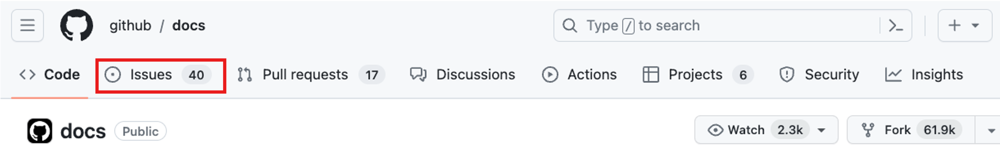

# GitHub Foundations

## Introduction

### What is version control?

A version control system (VCS) is a program or set of programs that tracks changes to a collection of files. With the goal to easily recall earlier versions of individual files or of the entire project.

Another name for a VCS is software configuration management (SCM). VCS is one of the practices involved in SCM.

Instances of VCS used a centralized server to store a project history. This centralization meant that the one server was also potentially a single point of failure.

**Git is distributed**, which means that a project's complete history is stored both on the client and on the server.

### Git terminology

- **Working tree**: The set of nested directories and files that contain the project that's being worked on.
- **Hash**: Git uses hashes that are 160 bits long, to identify if a file has changed or not. If the file timestamp is changed, but the file hash isn't changed, Git knowns the file contents aren't changed.
- **Object**: A Git repo contains four types of objects:
  - A blob object that contains an ordinary file.
  - A tree object represents a directory.
  - A commit object represents a specific version of the working tree.
  - A tag is a name attached to a commit.
- **Branch**: Is a named series of linked commits. The most recent commit of a branch is called the _head_.

### Git and GitHub

As mentioned previously, Git is a distributed version control system (DVCS). GitHub is a cloud platform that uses Git as its core technology, that acts as the remote repository.

### Basic Git commands

- `git status`
- `git add`
- `git commit`
- `git log`
- `git help`

## What is GitHub?

GitHub is a cloud-based platform that uses Git, a distributed version control (DVCS) system, as its core.

### Four pillars of GitHub

- **AI**: The GitHub Enterprise platform is enhancing collaboration through AI-powered pull requests and issues through Copilot, and security by automating security checks faster.
- **Collaboration**: Repos, Issues, Pull Requests, and other tools to help the whole company to work faster, cut down approval times, and ship more quickly.
- **Productivity**: CI/CD tools directly integrated into the workflow, the platform gives users the ability to set tasks and forget them. Giving time to developers to focus on what matters most.
- **Security**: GitHub Enterprise platform includes native, first-party security features that minimize security risk with a built-in security solutions. Security Overview and Dependabot are those features.

### Introduction to repositories

#### What is a repository?

A repository contains all of your project's files and each file's revision history.

- To create a repository, click on the plus button at the top right:


- To add a file to your repo, click on the **Add file** button


#### What are gists?

Similarly to repositories, gists are a simplified way to share code snippets with others. 
Basically, gist is a Git repository, which you can fork and clone to be made either public or secret. 

#### What are wikis?

Every repository on GitHub comes equipped with a section for hosting documentation, called a wiki. While a README file quickly tells what your project can do, you can use a wiki to provide additional documentation.

## Components of the GitHub flow

### What are branches?

Branches are an essential part to the GitHub experience because they're where we can make changes without affecting the entire project we're working on. Your branch is a safe place to experiment with new features or fixes.

### What are commits?

A commit is a change to one or more files on a branch. Every time a commit is created, it's assigned a unique ID and tracked along with the time and contributor. 

Within a git repository, a file can exist in several valid states as it goes through the version control process. The primary states for a file in a Git repository are **Untracked** and **Tracked**. These two states consist if Git is aware or not of the file existence. 

Tracked files are actively monitored by Git. And have the following substates:

- Unmodified: The file is tracked, but it hasn't been modified since the last commit.
- Modified: The file(s) has been changed since the last commit, is not staged yet.
- Staged: The modified file(s) are ready to be committed into the staged area (aka. index)
- Committed: The file is in the repository's database. It represents the last committed version of the file.

### What are pull requests?

A pull request is the mechanism used to signed that **the commits from one branch are ready to be merged into another branch**.

A team member who submits a pull request can request the review of other team members before the merge.

Once the changes have been approved (if required), the pull request's source branch is merged into the base branch. 


### The GitHub flow


The GitHub flow can be defined as a lightweight workflow that allows for safe experimentation. You can test new ideas and collaborate with your team by using branching, pull requests, and merging. 

1. Start by creating a branch so that the changes, features and fixes you create don't affect the main branch.
2. Next, make your changes on the branch you have created for experimentation.
3. Now, create a pull request to ask collaborators for feedback. On this step, reviews are important prior to the merge with the main branch.
4. If the code is reviewed and approved, the merge can occur to sync the code changes on the main branch.
5. Finally, you can delete your branch. To prevent that others use accidentally old branches.

## GitHub is a collaborative platform

Along of the features that allow to keep the project up-to-date as branches, and pull requests. GitHub has more features to improve collaboration within repositories.

### Issues

GitHub Issues were created to track ideas, feedbacks, tasks, or bugs for work on GitHub. An issue can be created from a repository:



Issues can be attached to a project, a pull request, and to a label as well.

### Discussions

Discussions are for conversations accessible to everyone and aren't related to code. 

> [!NOTE]
> Discussion is enabled on repository settings
> 

## GitHub platform management

### Managing notifications and subscriptions

You can choose to receive ongoing updates about specific activity on GitHub through a subscription. Notifications are the updates that you receive for specific activity to which you're subscribed.

#### Subscription options

You can choose to subscribe to notifications for:

- A conversation in a specific issue, pull request, or gist. 
- CI activity, such as the status of workflows in repositories set up with GitHub Actions.
- Repository issues, pull requests, releases, security alerts, or discussions (if enabled).
- All activities in repository.

#### What are GitHub Pages?

GitHub Pages is a static site-hosting service that takes HTML, CSS, and Javascript files straight from a repository on GitHub.
Optionally, you can run the files through a build process and publish a website. Edit and push your changes, and your project is live for the public in a visually organized way.

## Knowledge checks

- Which of the following scenarios is a common use case for a version control system?
  - Making experimental changes to your project in an isolated branch.
- What is another name for a version control system?
  - Software configuration management (SCM) system
- What’s the difference between Git and GitHub?
  - Git lets you work with one or more local branches and push changes to a remote repository. GitHub acts as the remote repository, which is accessed through a website or command-line tools.
- What Git command gives information about how to use Git?
  - `git help`

## Commands tested on the sandbox

- Initiate a git configuration setting the branch as main

```bash
git init -b main
```

- Create a new branch and check it out

```bash
git checkout -b newBranchName
```